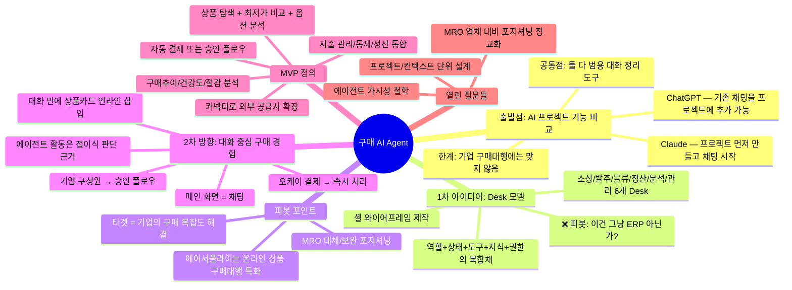
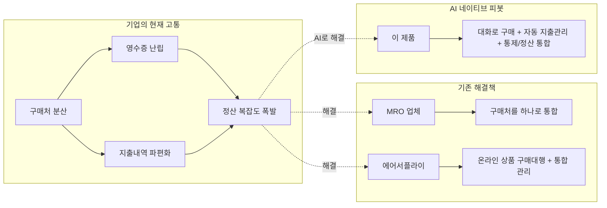
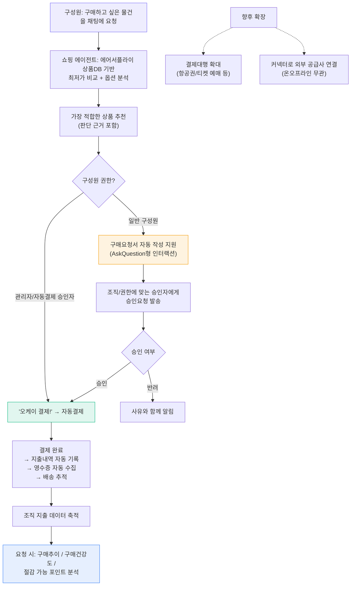
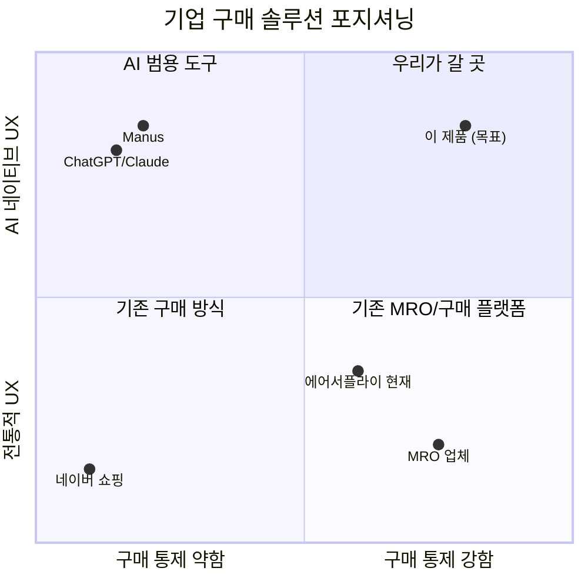

# 구매 AI Agent 아이데이션 로그

> 작성일: 2026-04-08 | 참여: 은서(제품총괄) + AI | 세션: Cowork 아이데이션
> 상태: 진행 중 (방향성 수립 → MVP 정의 단계)

---

## 서비스 컨텍스트 (필독)

### 타겟
**구매대행을 이용하는 기업** (구매대행 셀러가 아님)

### 풀고 있는 문제
기업이 필요한 물품을 여기저기서 구매하면 구매처가 분산되고, 영수증·지출내역·정산의 복잡도가 급격히 상승한다. 이 문제를 해결하기 위해 기업들은 MRO 업체를 이용해 구매처를 하나로 통합한다.

**에어서플라이는 이걸 약간 다른 방식으로 풀어왔고, 이번 제품은 그 위에 AI 네이티브로 피봇하는 개념이다.**

### 핵심 가치 재정의
- ~~셀러의 상품 탐색 자동화~~ → **기업 구매의 분산/복잡도 문제를 AI로 통합 해결**
- 구매처가 아무리 다양해도, 이 서비스 하나로 구매·지출관리·정산이 깔끔하게 되는 것
- MRO 업체 대비: 온라인 상품 특화 + AI로 탐색/비교/관리까지 자동화

---

## 전체 사고 흐름 맵



---

## Phase 1: AI 서비스 프로젝트 기능 비교에서 시작

### 출발 질문
> "AI 서비스들의 프로젝트 기능이 구매대행에도 적용 가능한가?"

### 조사 결과
- **ChatGPT**: 기존 채팅을 프로젝트에 드래그/이동 가능. 프로젝트 지시사항이 자동 상속. 암묵적(implicit) 컨텍스트 공유.
- **Claude**: 프로젝트 Knowledge Base에 명시적으로 넣어야 공유. 명시적(explicit) 컨텍스트 관리. RAG 자동 전환.
- **Google Gemini**: 프로젝트 기능 자체가 없음. Workspace 앱에 AI를 임베딩하는 전략.
- **Perplexity**: Collections로 리서치 쓰레드 그룹핑. 연구 특화.
- **Manus**: Playbook = 사전 정의 템플릿/워크플로우 모음. Meta에 인수됨.
- **Microsoft Copilot**: 독립 프로젝트 기능 없음. M365 통합 전략.

### 핵심 인사이트
각 서비스의 UI는 **"사용자의 생각이 어디서 시작되는가"**에 대한 가설에서 출발한다:
| 서비스 | 시작점 | 최적화된 사고 | 기업 구매 적합도 |
|--------|--------|-------------|---------------|
| ChatGPT/Claude | 질문 | 탐색적 사고 | 부분 적합 (상품 탐색) |
| NotebookLM | 자료 | 근거 기반 사고 | 부분 적합 (지출 분석) |
| Manus | 결과물 | 실행 위임 | 부분 적합 (자동화) |
| Zendesk/Freshdesk | 유입 태스크 | 반응형 업무 | 부분 적합 (요청 처리) |

→ **기업 구매는 한 가지 패러다임으로 안 잡힌다.** 탐색+승인+실행+관리가 동시에 일어나는 복합 프로세스.

---

## Phase 2: Desk 모델 제안 → 피봇

### Desk 개념 (1차 안)
**Desk = 역할(Role) + 지식(Knowledge) + 권한(Permission) + 도구(Tools) + 상태(State)**

기존 "프로젝트"와의 차이:
- 프로젝트: 대화+참고자료 묶음 (정적)
- Desk: 실시간 DB 연결 + 비즈니스 액션 실행 가능 (동적)

6개 기본 Desk 설계: 소싱, 발주, 물류, 정산, 분석, 관리
+ 커스텀 Desk 추가 가능 (예: 지점관리, 시즌기획)

셸 와이어프레임 HTML 제작 완료.

### ❌ 은서님 피드백 (피봇 포인트)
> "우리 서비스는 온라인 상품 구매대행에 특화. 공급망 연결은 부수적.
> 지금 이건 그냥 CRM/ERP 툴이랑 비슷한 형태 아닌가? 이게 무슨 경쟁력을 주는 거지?"

### 피봇 분석
잘못된 점:
1. 에어서플라이를 B2B 공급망 조달(procurement)로 오해석
2. 타겟을 "구매대행 셀러"로 잘못 설정 → 실제 타겟은 **구매대행을 이용하는 기업**
3. "Desk를 어떻게 나눌까"라는 구조 질문에 매몰
4. 결과물이 기존 SaaS 메뉴를 "Desk"로 이름만 바꾼 형태

옳았던 점:
1. Desk가 "공간"으로서의 가치는 있음
2. 에이전트 기반 권한 모델은 유효 (기업 내 역할별 접근 통제)
3. 커넥터 개념은 확장성에서 의미 있음

---

## Phase 3: 기업 구매의 본질로 회귀

### 문제 재정의



### 핵심 전환
- ~~셀러의 탐색 자동화~~ → **기업 구성원의 구매 경험 단순화 + 관리자의 통제/정산 자동화**
- 두 가지 사용자가 있다:
  - **구매 요청자** (일반 구성원): "이거 사고 싶은데" → 간편하게 요청
  - **관리자/승인권자**: 지출 통제, 승인, 정산, 분석

### 정보 아키텍처 방향
```
조직(기업) 레이어 — 예산, 정책, 권한, 공급업체 설정
  └─ 구성원별 구매 쓰레드 — 요청 → 승인 → 구매 → 정산
      (대화 형태로 흘러가되, 지출 데이터는 조직 레이어에 자동 축적)
```

→ 기업 입장에서 보는 건 "채팅 앱"이 아니라 **"구매 통제가 되는 AI 구매 창구"**

---

## Phase 4: MVP 기능 정의

### 은서님이 정의한 MVP



### MVP가 기업에게 주는 가치

| 기존 고통 | MVP가 해결하는 방식 |
|----------|------------------|
| 구매처 분산 → 영수증 난립 | AI가 최적 상품을 찾아주니 구매처가 에어서플라이로 자연 통합 |
| 지출내역 파편화 | 모든 구매가 대화에서 시작되니 지출이 자동 기록/분류됨 |
| 정산 복잡도 | 결제→영수증→정산이 하나의 파이프라인으로 자동화 |
| 구매 통제 어려움 | 승인 플로우가 자연스럽게 내장 (권한별 자동 라우팅) |
| 지출 분석 부재 | 축적된 데이터 기반 인사이트 (온디맨드) |

### 필요한 에이전트

| 에이전트 | 역할 | MVP 포함 | 비고 |
|---------|------|---------|------|
| 쇼핑 에이전트 | 상품 탐색, 최저가 비교, 옵션 분석, 추천 | ✅ | 핵심. 기업 구성원이 직접 대화하는 상대 |
| 결제 에이전트 | 결제 실행, 결제수단 관리, 영수증 자동 수집 | ✅ | 보안상 독립 권한 체계 필수 |
| 승인 에이전트 | 구매요청서 생성, 승인 라우팅, 상태 추적, 알림 | ✅ | 기업 구매 통제의 핵심 |
| 분석 에이전트 | 지출 분석, 구매 건강도, 절감 포인트 | ✅ (온디맨드) | 관리자용. 요청 시 분석 |
| 커넥터 레이어 | 외부 공급사/서비스 연결 (항공권 등) | 아키텍처만 | MVP 후 확장 |

### 사용자 관점 핵심 원칙
> **구성원에게는:** "카톡하듯 말하면 회사에서 필요한 물건을 알아서 사준다"
> **관리자에게는:** "구성원들이 뭘 사든 자동으로 통제되고 정산된다"
> **에이전트가 몇 개인지는 아무도 몰라도 된다.** 하나의 구매 비서와 대화하는 느낌.

---

## Phase 5: 에이전트 가시성(Visibility) 철학

### 다른 서비스들이 에이전트 활동을 안 보여주는 이유

| 이유 | 설명 |
|------|------|
| 결과 > 과정 | 대부분의 사용자는 과정이 아니라 결과를 원함 |
| 속도 인식 | 과정을 보여주면 "느리다"고 느낌 |
| 실수 노출 | 잘못된 경로를 갔다가 돌아오면 신뢰 하락 |
| 범용이라 맥락 불명확 | 뭘 보여줘야 사용자가 만족하는지 특정 불가 |

**Manus가 예외인 이유:** "AI가 대신 일해준다"는 위임의 신뢰감을 증명하기 위해. 단, 익숙해지면 스킵하는 한계.

### 우리의 선택: 활동 로그가 아닌 "판단 근거"

| ❌ 활동 로그 (약함) | ✅ 판단 근거 (강함) |
|--------------------|-------------------|
| 14:30 검색 시작 | **추천 이유:** |
| 14:31 12개 발견 | 1) 동일 상품 최저가 ₩18,900 (12% 할인 중) |
| 14:32 비교 완료 | 2) 우리 회사 최근 3개월 이 카테고리 평균 단가 대비 23% 절감 |
| 14:33 결과 생성 | 3) 리뷰 4.7, 배송 1.2일 |

**기업 구매에서 이게 특히 중요한 이유:**
- 돈이 나가는 행위 → 확신이 필요 (불안 해소)
- 관리자는 "왜 이걸 승인해야 하지?" → 판단 근거가 승인 속도를 올림
- 정산 시 "왜 이 가격에 샀나?" → 감사(audit) 대응

### 설계 원칙
1. **기본: 결과만 보여줌** — 추천 상품 카드가 대화 안에 인라인 삽입
2. **선택적: 판단 근거 접이식** — "추천 이유 보기" 또는 "왜 이걸 추천했어?"로 펼침
3. **비즈니스 가치 언어 사용** — "회사 평균 대비 23% 절감", "이전 구매 대비 단가 하락" (기술 용어 X)
4. **관리자 뷰에서는 더 풍부하게** — 승인 화면에서 판단 근거가 기본 노출

→ 범용 AI는 맥락이 불명확해서 보여줄 게 모호하지만, **기업 구매는 도메인이 좁고 명확**해서 "뭘 보여줘야 확신을 갖는지"를 정확히 설계할 수 있다. **이게 버티컬 AI의 진짜 엣지.**

---

## Phase 6: UI 방향성 수렴

### MVP 메인 경험 (현재 합의)

**구성원 화면:**
```
┌──────────────────────────────────────────────┐
│                 메인 = 대화                    │
│                                              │
│  👤 "회의실에 놓을 블루투스 스피커 하나 사야 하는데" │
│                                              │
│  🤖 조건 몇 가지 확인할게요.                     │
│     예산 범위가 있나요? 어떤 크기를 원하세요?       │
│                                              │
│  👤 "10만원 이하, 소형이면 좋겠어"               │
│                                              │
│  🤖 3개 상품을 찾았습니다.                       │
│  ┌──────────────────────────────────────┐    │
│  │ [상품A] [상품B ⭐추천] [상품C]          │    │
│  │  ₩89,000  ₩76,500      ₩95,000      │    │
│  │          "추천 이유 보기 ▾"            │    │
│  │          "회사 평균 대비 15% 절감"      │    │
│  └──────────────────────────────────────┘    │
│                                              │
│  👤 "B로 결제해줘"                             │
│                                              │
│  🤖 구매요청서를 작성했습니다.                     │
│     부서: 기획팀 / 용도: 회의실 비품               │
│     → 김팀장에게 승인요청을 보냈습니다.             │
│                                              │
│  🔔 승인 완료! 결제가 진행됩니다.                  │
│     배송 예정: 4/10 (목)                       │
│                                              │
└──────────────────────────────────────────────┘
```

**관리자 화면 (별도 뷰 또는 Desk형):**
- 승인 대기 건 목록 + 판단 근거 기본 노출
- 부서별/구성원별 지출 현황 대시보드
- "이번 달 지출이 예산의 몇 %야?" 같은 대화형 분석

### Desk 개념의 재활용 가능성
Desk 자체가 나빴던 건 아님. 다만:
- ~~기능 단위 메뉴~~ → **관리자의 통제 뷰**로 재정의 가능
- 구성원에게는 대화 하나면 충분, 관리자에게는 Desk형 관리 뷰 제공
- MVP에서는 대화가 메인, 관리 뷰는 보조

---

## 경쟁 구도 정리



---

## 열린 질문 (다음 논의 필요)

### 아키텍처/설계

| # | 질문 | 방향성 메모 |
|---|------|-----------|
| 1 | 컨텍스트 단위: 조직? 부서? 개인? | 조직 레이어(지속) + 개인 대화 쓰레드(일시) 2레이어 유력 |
| 2 | 에이전트 인격(Persona)이 필요한가? | 구성원에게는 하나의 비서. 내부적으로만 역할 분리 |
| 3 | 커넥터 아키텍처를 초기부터 설계해야 하나? | MVP에서는 에어서플라이 DB만. 설계만 선행 |
| 4 | 기존 에어서플라이 데이터 마이그레이션 전략 | 과거 구매 이력 → Knowledge 자동 매핑 검토 필요 |

### 비즈니스/전략

| # | 질문 | 방향성 메모 |
|---|------|-----------|
| 5 | 기존 에어서플라이 기업 고객을 어떻게 전환하나? | 점진적 전환 vs 병행 운영 vs 신규 앱 |
| 6 | 가격 모델은? | 구성원 수 기반? 거래액 기반? 구독? |
| 7 | 결제대행 확장 (항공권 등) 시 규제 이슈 | 결제대행업 라이선스 검토 필요 |
| 8 | MRO 업체 대비 명확한 차별화 메시지 | "AI가 찾아주니까 더 싸고, 자동 관리되니까 더 편하다" |
| 9 | 기업 도입 시 보안 심사 대응 | 구매/결제 데이터 보안 인증 필요성 검토 |

### UX/UI

| # | 질문 | 방향성 메모 |
|---|------|-----------|
| 10 | ~~구성원 화면 vs 관리자 화면 분리 수준~~ | ✅ **해결 (v4)**: 같은 앱, 역할 기반 점진적 확장. Icon Rail 구분선 패턴 — 위=공통, 아래=역할별 관리 아이콘 추가. Progressive Onboarding의 Layer별 아이콘 해금과 연동. |
| 11 | 모바일 경험은 어떻게? | 대화 중심이면 모바일 친화적. MVP에서 제외, 웹 우선. |
| 12 | ~~승인 알림 체계 설계~~ | ✅ **해결 (v4)**: 슬랙 DM 1순위 → Lambda 앱 내 뱃지 → 이메일 폴백. 긴급 구매는 슬랙 멘션 + 1h 리마인더. 24h 무응답 시 에스컬레이션. |
| 13 | ~~온보딩 플로우~~ | ✅ **해결 (v3)**: Progressive Onboarding Layer 0~4. 행동 기반 트리거. |

---

## 산출물 목록

| 파일 | 설명 | 상태 |
|------|------|------|
| `purchasing-agent-planning.md` | Desk 모델 기반 기획서 (v0.1) | ⚠️ 피봇 전 버전 — 구조 참고용 |
| `shell-wireframe.html` | 셸 와이어프레임 (인터랙티브) | ⚠️ 피봇 전 버전 — Desk 구조 참고용 |
| `purchasing-agent-ideation-log.md` | 이 문서 (아이데이션 로그) | ✅ 최신 (v2 — 타겟 교정 반영) |

---

## Phase 7: GUI 구조 + 상품 컨텍스트 모델

> 출발점: 현재 에어서플라이 오피스 화면(폴더/스토어/관리/알림)을 참고하되,
> Lambda은 **별도 제품**으로 GUI를 처음부터 설계. 에어서플라이 DB/API를 백엔드로 활용.

### 대화 바깥에 왜 다른 화면이 필요한가?

Phase 6에서 "메인 = 대화"로 합의했지만, 대화만으로 안 되는 순간이 세 가지 있다:

1. **뭘 사야 할지 모르는 상태** — 카탈로그를 눈으로 훑으며 아이디어를 얻는 탐색. 채팅으로 대체 불가.
2. **반복 구매를 관리하는 상태** — 매달 사는 것들 목록을 대화 스크롤로 관리하면 지옥.
3. **비교/검토하는 상태** — 상품 3개를 옵션·가격·리뷰로 비교할 때 채팅 버블 안에서는 한계.

→ 스토어와 "내 상품" 뷰가 존재해야 하는 이유. 단, **독립된 탭이 아니라 대화의 보조 화면**으로 설계.

### 사이드바: 게임 런처 스타일

**Icon Rail(48px) + Context Panel(200~260px, 접기 가능) + Main Content**

```
┌──────┬──────────────┬──────────────────────────────────┐
│ 💬   │  컨텍스트     │                                  │
│ 📦   │  패널        │        메인 콘텐츠 영역            │
│ 🛒   │  (접기 가능)  │                                  │
│ 🔍   │              │  선택한 모드에 따라 바뀜            │
│ ⚙️   │              │                                  │
│ 🔔   │              │                                  │
└──────┴──────────────┴──────────────────────────────────┘
```

- **레일 기본 상태**: 아이콘만 (깔끔, 콘텐츠 공간 최대화)
- **호버**: 아이콘 옆 툴팁 ("대화", "내 상품", "스토어", "설정")
- **클릭**: 컨텍스트 패널 슬라이드 오픈. 다른 아이콘 클릭 시 패널 내용 전환
- **뱃지**: 💬에 "승인 대기 2건", 🔔에 "배송 완료 1건"

참고 모델: Discord(서버 아이콘 → 채널 목록 → 대화), Steam(라이브러리/컬렉션)

**레일 아이콘 순서 = 제품 철학 선언:**
- 채팅을 맨 위 → "이 제품은 대화가 시작점" (Lambda 원래 방향)
- 스토어를 맨 위 → "탐색이 시작점, AI는 보조" (에어서플라이에 가까움)
- 점진적 전환: 초기엔 스토어/내상품이 위, 채팅이 아래 → 사용자가 익숙해지면 채팅 비중 상승

### 스토어 vs 내 상품 — 역할 분리

**🔍 스토어 = 발견의 공간 (Discovery)**
- 에어서플라이 상품 DB를 API로 가져와 시각적 카탈로그 제공
- 카테고리 탐색, 검색, 필터링
- 액션: "장바구니에 담기" 또는 "내 상품에 저장"
- AI 역할: 검색 보조 수준 ("비슷한 상품 더 보기", "리뷰 요약")
- 감정: 쇼핑, 가볍고 탐색적

**📦 내 상품 = 의사결정의 공간 (Workspace)**
- 이전에 "폴더"로 불렀으나, **상품 컨텍스트 기반 동적 뷰**로 재정의 (아래 상세)
- AI 역할: 능동적 ("재주문 시점", "가격 변동", "대안 발견")
- 감정: 일, 효율적이고 판단에 도움

**두 공간의 연결:**
- 스토어에서 상품 클릭 → 상세 패널이 슬라이드로 열림 (페이지 이동 없음)
- 어디서든 "💬 AI에게 물어보기"로 대화 모드 진입 가능
- 대화 중 "[내 상품에서 보기→]" 클릭 시 뷰 전환 (같은 데이터, 다른 인터페이스)

### ⭐ 핵심 전환: 폴더 → 상품 컨텍스트 모델

#### 왜 폴더를 버리는가?

**기존 사고 (폴더 중심):** 사람이 구조를 먼저 만들고 → 상품을 배치
**새로운 사고 (상품 컨텍스트 중심):** 상품이 존재하고 → 맥락이 자동 축적 → AI가 동적으로 묶어서 보여줌

폴더의 한계:
1. 하나의 상품이 여러 맥락에 동시 소속 불가 (A4용지 = 사무용품이면서 월간구매이면서 총무팀 관할)
2. 신규 고객이 폴더를 먼저 만들어야 시작 가능 → 콜드스타트 마찰
3. AI가 일하려면 폴더 안의 상품만 볼 수 있음 → 폴더 간 인사이트 불가

#### 상품 컨텍스트란?

구매가 일어날 때마다 상품에 맥락 정보가 자동 축적되는 레이어.

```
상품: 시디즈 T50 (에어서플라이 SKU 참조)
├ context:
│  ├ 구매자: 김지은 (총무)
│  ├ 용도: "회의실 의자" (대화에서 자연어 추출)
│  ├ 구매 이력: [{4/8, 5개, ₩156,000}, {4/22, 1개, ₩149,000}]
│  ├ 가격 추이: ₩156,000 → ₩149,000 (▼4.5%)
│  ├ 구매 패턴: 비정기 (2회, 패턴 미확정)
│  ├ 공급처: 쿠팡 via 에어서플라이
│  └ 조직/팀: 모먼트랩
```

#### "폴더"는 죽지 않고, 저장된 뷰(Saved View)가 된다

"내 상품" 안의 구성:

```
📦 내 상품
├ 🤖 AI 추천 뷰 (자동 생성)
│  ├ 🔄 월간 재주문 (3개)
│  ├ 📉 가격 내린 상품 (2개)
│  └ ⚠️ 품절 임박 (1개)
├ 📌 핀한 뷰 (사용자가 고정)
│  ├ 회의실 비품
│  └ 분기 정기구매
└ ⏱ 최근 구매 (시간순)
```

- **AI 추천 뷰**: 상품 컨텍스트를 분석해서 AI가 동적 생성. 상품 구매 패턴, 가격 변동, 재고 상태 등 감지.
- **핀한 뷰**: 사용자가 의도적으로 고정한 묶음. 기존 "폴더"와 비슷하지만, 내부는 컨텍스트 기반 필터.
- **최근 구매**: 시간순 원본 데이터. 정리 없이도 바로 접근 가능.

→ **정리를 안 해도 AI가 구조를 만들어주고, 정리를 좋아하면 핀해서 고정할 수 있다.**

#### 콜드스타트 해결

**에어서플라이 기존 고객:**
- "에어서플라이에서 가져오기" → 기존 폴더 구조 + 상품 + 구매 이력을 Lambda 상품 컨텍스트로 변환
- 가져온 즉시 AI가 패턴 분석 → 추천 뷰 자동 생성

**완전 신규 고객:**
- 첫 화면 = 채팅. "A4용지 사야 해"로 바로 시작
- 구매할 때마다 상품 컨텍스트 자동 축적
- 3~5회 구매 후 AI가 패턴 감지 → 추천 뷰 제안 시작

#### ⚠️ 열린 질문: SKU 공유 구조와의 충돌 가능성

에어서플라이는 **옵션이 동일한 상품을 하나의 SKU로 묶어서** 여러 회사 간 공유한다.
Lambda의 상품 컨텍스트는 **회사/팀/개인별로 다른 맥락**을 붙인다.

```
에어서플라이 SKU: "시디즈 T50 블랙"
├ A사의 컨텍스트: 회의실용, 월 2회, 예산 비품
├ B사의 컨텍스트: 임원실용, 분기 1회, 예산 시설
└ C사의 컨텍스트: (없음 — 아직 안 삼)
```

→ Lambda 컨텍스트 레이어는 **에어서플라이 SKU 위에 회사별로 분리된 별도 레이어**로 설계해야 한다.
→ SKU 자체를 수정하는 게 아니라, SKU를 참조하는 Lambda 자체 데이터 모델이 필요.
→ 이 구조가 기술적으로 가능한지, 에어서플라이 상품 API가 어떤 수준까지 노출하는지 확인 필요.

### 권한 체계: RBAC + 뷰 스코프

별도 제품이므로 Lambda 자체 권한 체계.

```
Lambda 조직 셋업 (⚙️ 관리자가 1회)
├ 역할 템플릿 (기본 3개 + 커스텀)
│  ├ Admin: 모든 기능 + 결제수단 + 멤버 관리
│  ├ Buyer: 주문 실행 + 접근 가능 뷰 내 구매
│  └ Requester: 구매 요청만 (승인 필요)
├ 팀 = 뷰 접근 묶음
│  "마케팅팀" 소속 → 마케팅 관련 뷰 자동 접근
└ 예산 정책 (역할 x 팀)
   "Requester + 마케팅팀" → 건당 5만원 초과 시 팀장 승인
```

대화에서의 권한 적용: 사용자가 의식하지 않아도 AI가 자동 체크.
→ "₩76,000은 한도 초과예요. 김팀장님에게 승인 요청 보낼까요?"

### 다른 AI 에이전트의 조직화 패턴 비교

| 패턴 | 대표 사례 | 조직 단위 | AI 능동성 | Lambda 차용 |
|------|----------|----------|----------|-------------|
| 대화 컨테이너 | ChatGPT/Claude Projects | 프로젝트(사용자 생성) | 수동 (질문해야 작동) | 컨텍스트 자동 로드 |
| 컨텍스트 메모리 | Perplexity Spaces | 스페이스(사용자 생성) | 반능동 (기억은 하되 먼저 말 안 걸음) | 누적 기억 |
| 워크플로우 자동화 | Manus Playbooks, Coupa | 플레이북/구매요청(시스템) | 능동 (규칙 기반 실행) | 재주문 감지, 가격 알림 |
| **Lambda** | — | **상품 컨텍스트 + 동적 뷰** | **능동 (패턴 감지 → 제안)** | 세 패턴의 조합 |

→ "맥락을 기억하면서(패턴2) 능동적으로 행동하고(패턴3) 대화 안에서 자연스럽게 작동하는(패턴1)" 구조는 현재 시장에 없음.

---

## 열린 질문 (업데이트 — v4 반영)

### 아키텍처/설계

| # | 질문 | 방향성 메모 |
|---|------|-----------|
| 14 | 에어서플라이 SKU 공유 구조 위에 회사별 컨텍스트 레이어를 어떻게 얹을 것인가? | Lambda 자체 DB에 `product_context` 테이블 설계. SKU ID 참조 + org_id로 분리. |
| 15 | 상품 컨텍스트에서 "용도"를 자연어에서 어떻게 추출/분류할 것인가? | 대화에서 LLM이 추출 → 표준 카테고리 매핑? 자유 텍스트? |
| 16 | AI가 "뷰"를 자동 생성하는 기준은? 어떤 패턴을 감지하면 어떤 뷰를 제안하는가? | 구매 주기(≥3회 반복), 가격 변동(≥5%), 품절 임박 등 규칙 정의 필요 |
| 17 | Lambda 핀한 뷰(Saved View)와 에어서플라이 기존 폴더의 관계는? | 초기 마이그레이션 시 1:1 뷰 변환. 이후 단방향 참조(Lambda→에어서플라이 SKU)가 유력. |
| 18 | 승인 에스컬레이션 체인 깊이 제한? | 현재 2단계(Buyer→Admin). 대기업 확장 시 3단계 이상 필요할 수 있음. MVP는 2단계. |
| 19 | 슬랙 외 알림 채널 우선순위? | MVP: 슬랙 + Lambda 인앱. 이후: 카카오워크, 팀즈, 이메일. |

### 비즈니스/전략

| # | 질문 | 방향성 메모 |
|---|------|-----------|
| 5 | 기존 에어서플라이 기업 고객을 어떻게 전환하나? | 점진적 전환 vs 병행 운영 vs 신규 앱 |
| 6 | 가격 모델은? | ✅ **방향 수립 (v3)**: SaaS 구독 + 토큰 과금. Free/Starter/Business 3tier. |
| 7 | 결제대행 확장 (항공권 등) 시 규제 이슈 | 결제대행업 라이선스 검토 필요 |
| 8 | MRO 업체 대비 명확한 차별화 메시지 | "AI가 찾아주니까 더 싸고, 자동 관리되니까 더 편하다" |
| ~~9~~ | ~~기업 도입 시 보안 심사 대응~~ | 구매/결제 데이터 보안 인증 필요성 검토 |

---

## 산출물 목록

| 파일 | 설명 | 상태 |
|------|------|------|
| `purchasing-agent-planning.md` | Desk 모델 기반 기획서 (v0.1) | ⚠️ 피봇 전 버전 — 구조 참고용 |
| `shell-wireframe.html` | 셸 와이어프레임 (인터랙티브) | ⚠️ 피봇 전 버전 — Desk 구조 참고용 |
| `purchasing-agent-ideation-log.md` | 이 문서 (아이데이션 로그) | ✅ 최신 (v4 — 뷰 모델 + 화면 분리 + 승인 플로우 반영) |
| `mvp-pre-planning.md` | MVP 선행 기획서 | ✅ 최신 (v4 — 폴더→뷰 통일 + 섹션 9-10 추가) |

---

*다음 세션 예상: 와이어프레임 설계 시작. 체크리스트 #7(커넥터 아키텍처), #8(에이전트 오케스트레이션), #10(에어서플라이 연동 범위)은 와이어프레임과 병행 가능.*
